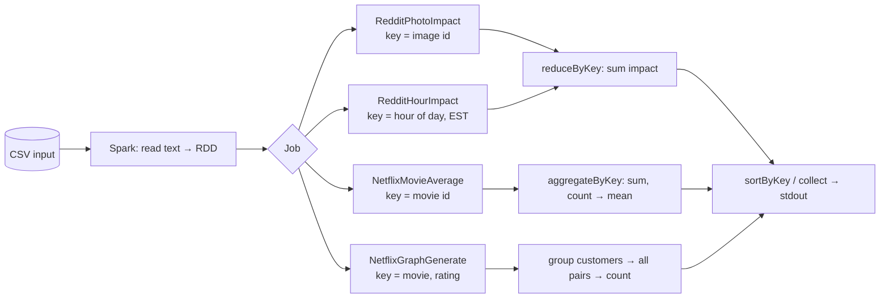

<div align="center">

# Spark Reddit & Netflix Analytics

**Distributed batch analytics on Reddit and Netflix-style datasets, built with Apache Spark (Java RDD API).**

[](https://github.com/muhammadsohail613/Analyzing-Reddit-and-Netflix-Datasets-using-Spark/actions/workflows/ci.yml)


</div>

---

## Overview

Four self-contained Spark jobs that turn raw CSV data into answers: which Reddit photo got the
most engagement, what time of day is Reddit most active, which Netflix movies are rated highest,
and which customers have the most similar taste.

| Job | Question it answers | Spark pattern |
|---|---|---|
| [`RedditPhotoImpact`](src/main/java/com/RUSpark/RedditPhotoImpact.java) | Which photo has the highest total engagement? | `mapToPair` → `reduceByKey` → `sortByKey` |
| [`RedditHourImpact`](src/main/java/com/RUSpark/RedditHourImpact.java) | Which hour of the day (US Eastern) drives the most engagement? | `mapToPair` → `reduceByKey` → `sortByKey` |
| [`NetflixMovieAverage`](src/main/java/com/RUSpark/NetflixMovieAverage.java) | What is each movie's average rating? | single-pass `aggregateByKey` (sum, count) |
| [`NetflixGraphGenerate`](src/main/java/com/RUSpark/NetflixGraphGenerate.java) | Which customers rate movies alike, and how strongly? | `distinct` → `groupByKey` → `flatMapToPair` → `reduceByKey` |

> **Impact** = `upvotes + downvotes + comments`, summed over all rows for a photo or an hour.

## Key results (full dataset)

| Insight | Result |
|---|---|
| Most impactful Reddit photo | **#1437**, impact **192,896** |
| Most impactful hour (EST) | **20:00**, impact **15,057,971** |
| Highest-rated Netflix movies | **#7485** (4.74), **#7230** (4.72), **#14961** (4.72) |

## Architecture



## Quick start

**Prerequisites:** JDK 11 or 17, Maven 3.6+. (Apache Spark itself is only needed for `spark-submit`;
the tests and the demo below run Spark in-process.)

```bash
git clone https://github.com/muhammadsohail613/Analyzing-Reddit-and-Netflix-Datasets-using-Spark.git
cd Analyzing-Reddit-and-Netflix-Datasets-using-Spark

mvn verify            # compile + run the test suite
```

Run a job on the bundled sample data with `spark-submit`:

```bash
scripts/run.sh RedditPhotoImpact    data/sample/reddit_sample.csv
scripts/run.sh RedditHourImpact     data/sample/reddit_sample.csv
scripts/run.sh NetflixMovieAverage  data/sample/netflix_sample.csv
scripts/run.sh NetflixGraphGenerate data/sample/netflix_sample.csv      # optional 3rd arg: minimum edge weight
```

### Example output (sample data)

```text
$ scripts/run.sh NetflixMovieAverage data/sample/netflix_sample.csv
1 4.67
2 5.00
3 3.33

$ scripts/run.sh RedditHourImpact data/sample/reddit_sample.csv
0 6
7 6
17 147
18 16

$ scripts/run.sh NetflixGraphGenerate data/sample/netflix_sample.csv
(10,20) 2
(10,30) 1
(20,30) 1
```

For a Top-N view of the Netflix averages: `... | sort -k2 -nr | head -3`.

## Input formats

Both datasets are plain CSV files with no header row. Double-quoted fields may contain commas.

| Dataset | Columns (in order) |
|---|---|
| Reddit | `image_id, unix_time, title, total_votes, upvotes, downvotes, comments` |
| Netflix | `movie_id, customer_id, rating, date` |

The full datasets are not committed because of their size; small samples live in [`data/sample/`](data/sample).

## Design notes

- **Testable by construction.** Each job exposes its core transformation as a pure function over
  `JavaRDD<String>`; `main` only does I/O. The JUnit tests run the real Spark engine (`local[2]`)
  against the sample data and assert exact results, including a DST edge case for the hour job.
- **One pass over the data.** `NetflixMovieAverage` carries `(sum, count)` through a single
  `aggregateByKey`, instead of computing sums and counts separately and joining them with a
  driver-side lookup.
- **Correct time handling.** Hours are derived with `java.time` in `America/New_York`, so daylight
  saving is handled correctly and there is no thread-unsafe `SimpleDateFormat` inside a closure.
- **Overflow-safe sums.** Impact totals use `long`; ratings use `double` rather than `float`.
- **Honest complexity.** `NetflixGraphGenerate` emits *n(n−1)/2* pairs per `(movie, rating)` bucket,
  so popular movies dominate its cost. The optional `minWeight` argument prunes the output.
  Duplicate rows are removed first so a customer is never paired with themselves.

## Project structure

```text
.
├── pom.xml                              # Maven build (Spark 3.5, JUnit 5)
├── src/main/java/com/RUSpark/           # The four jobs + shared CSV helper
├── src/test/java/com/RUSpark/           # Spark-backed JUnit tests
├── data/sample/                         # Tiny datasets used by the demo and tests
├── scripts/run.sh                       # spark-submit wrapper
└── .github/workflows/ci.yml             # Build + test on JDK 11 and 17
```

## Lessons learned

- Spark runs on specific JDK versions only. Using an unsupported JDK (e.g. 17 with older Spark 3.x)
  fails at startup; the build pins a compatible Spark release and passes the required
  `--add-opens` flags for modern JDKs.
- On Windows, Hadoop's native libraries (`winutils`) must match the machine architecture (64-bit);
  a 32-bit build causes cryptic I/O failures when Spark touches the local filesystem.

## Tech stack

Java · Apache Spark (RDD API) · Maven · JUnit 5 · GitHub Actions

## License

Released under the [MIT License](LICENSE).
